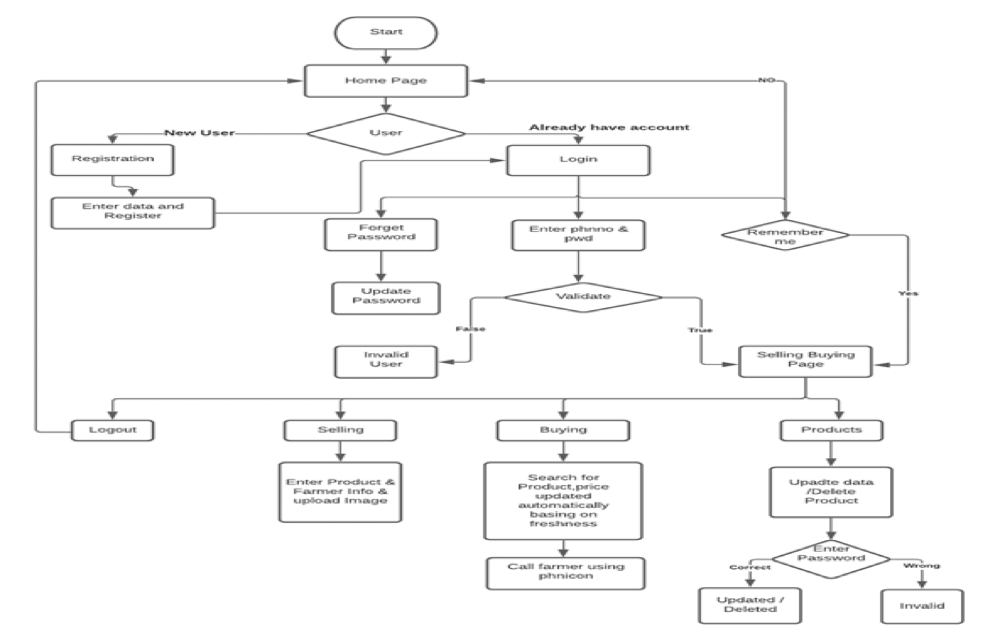
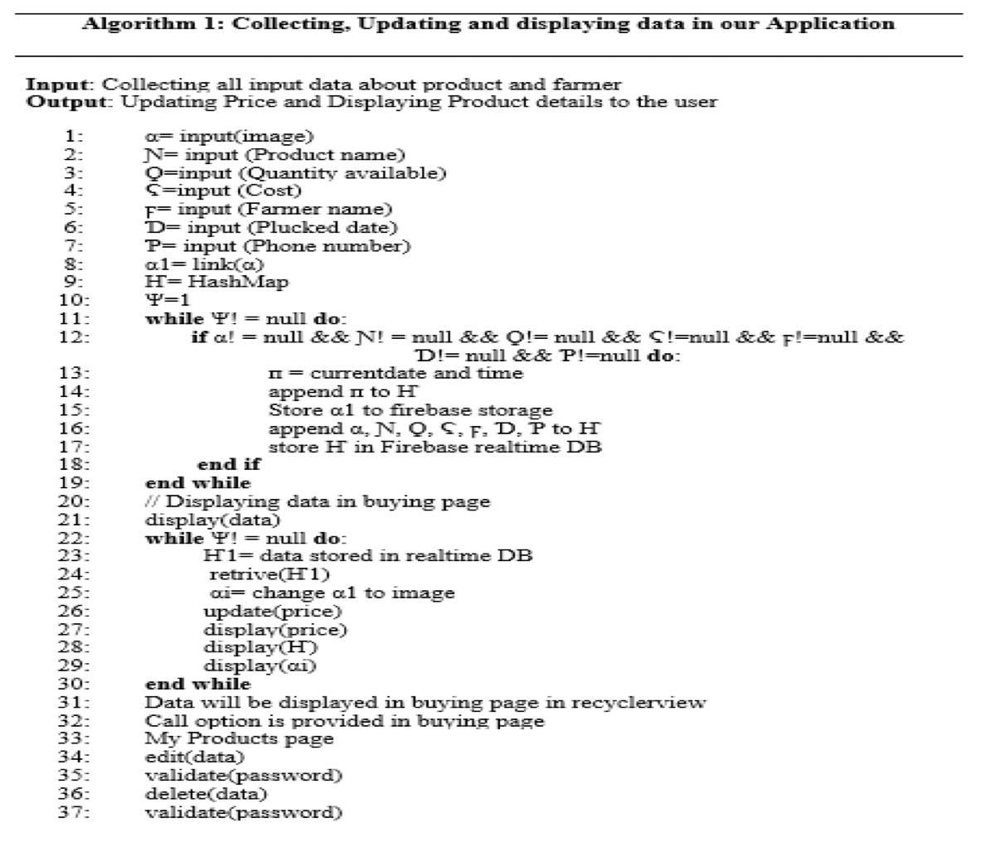
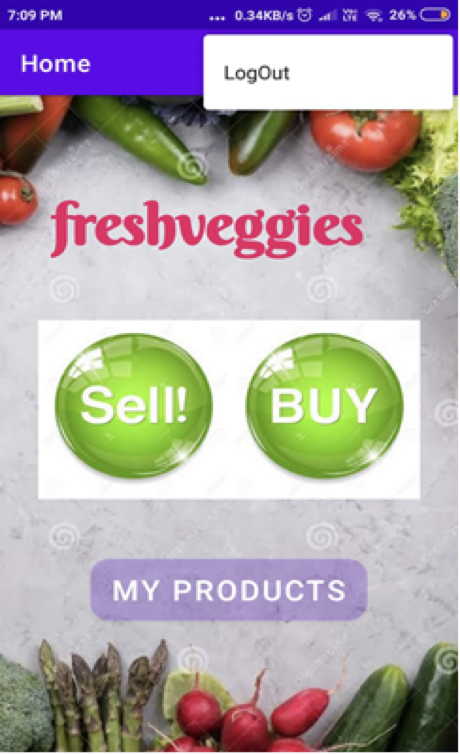
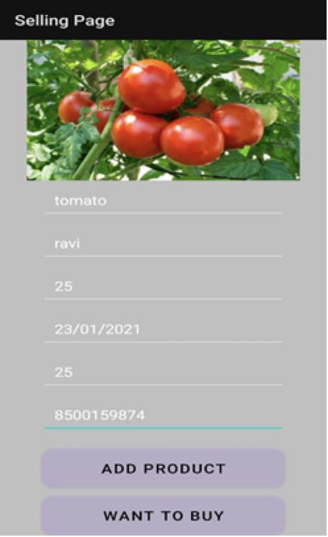
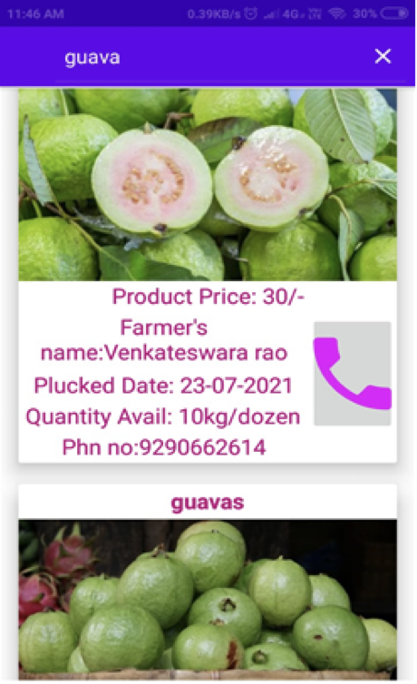
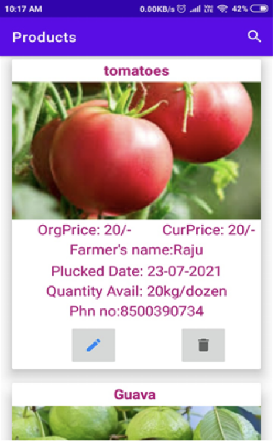

# Fresh Veggies – Android Application  
A mobile application to facilitate direct buying and selling of fruits and vegetables among farmers, eliminating middlemen and ensuring better profits.

## Project Overview  
In many villages, farmers sell their produce to middlemen, leading to lower profits. This app acts as a direct marketplace for farmers to trade their products at fair prices.  

## Problem Statement  
- Farmers sell produce to middlemen at low margins.  
- They purchase non-cultivated products at higher costs.  
- There is a lack of direct access to consumers.  

## Motivation  
- Reducing farmer suicides due to financial struggles.  
- Providing fair pricing by eliminating middlemen.  
- Ensuring fresh produce reaches consumers efficiently.  

## Objectives  
- Enable farmers to buy and sell directly within their community.  
- Provide a user-friendly Android application.  
- Implement dynamic pricing based on product freshness.  

## Scope  
- Expand to nearby villages.  
- Include non-farmer users for wider reach.  
- Improve farmers' profit margins.  

## Technology Stack  
- **Android Studio** – App development  
- **Java** – Core programming language  
- **Firebase** – Realtime database & storage  
- **XML** – UI design  

## Process Flow  
1. **User Authentication:** Signup/Login with "Remember Me" and "Forgot Password" options.  
2. **Selling Process:** Farmers list products with price, availability, and images.  
3. **Buying Process:** Users search for products, check availability, and contact sellers.  
4. **Freshness-based Pricing:** Prices decrease every 6 hours to ensure sales.  

## Key Features  
- ✅ **Direct Farmer-to-Farmer & Farmer-to-Consumer Trading**  
- ✅ **Dynamic Pricing Model**  
- ✅ **Firebase Backend for Realtime Updates**  
- ✅ **Product Image Storage & Listing**  
- ✅ **Editable Product Listings**  

## Results & Impact  
- Eliminates middlemen, increasing farmers' profits.  
- Ensures consumers receive fresh produce at fair prices.  
- Encourages digital adoption among small-scale farmers.  

## Flow Chart  
Below is the process flow diagram representing how the system works:  

  

## Algorithm  
1. **User Registration & Authentication**  
   - If new user → Register → Store details in Firebase  
   - If existing user → Login with credentials  
2. **Selling Process**  
   - User selects "Sell Product"  
   - Enters product details (name, price, availability, freshness)  
   - Uploads product image → Stored in Firebase  
3. **Buying Process**  
   - User searches for a product  
   - System fetches products from Firebase  
   - User contacts the seller for purchase  
4. **Dynamic Pricing**  
   - Product price decreases every 6 hours until sold  
5. **Product Updates**  
   - Sellers can update or delete their listings  
   - If stock = 0, product is removed automatically
  
  

## 📸 Output Screens  
Below are the screenshots of the application:  

### Home Page  
  

### Selling Page  
  

### Buying Page  
  

### My Products  
  

## Conclusion  
The app bridges the gap between farmers and consumers, creating a direct and transparent marketplace that benefits both parties.  
